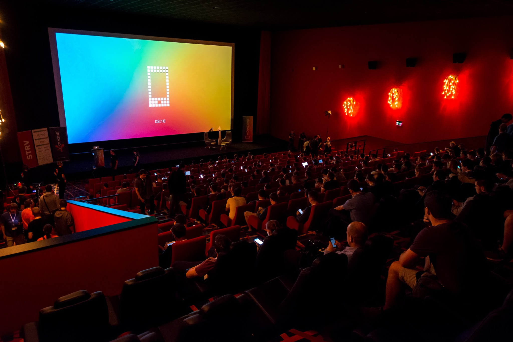

# mDevLogo

Animated logo for keynote at [mDevCamp](https://mdevcamp.eu/) 2016 conference.

Uses [Fast Fourier transform](https://en.wikipedia.org/wiki/Fast_Fourier_transform) to analyze currently playing audio and adjust the animation scale accordingly to the audio loudness.

## Controls

`Space` - Play/Pause countdown, music and animation

`Arrows` - Move the time

## Screenshots

